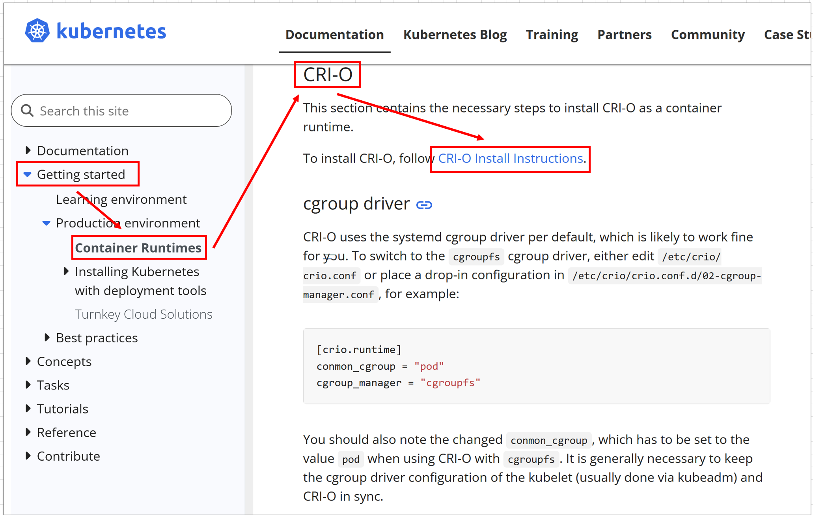
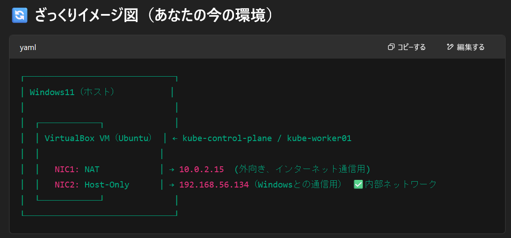

# はじめに

[Kunbernetes Document](https://kubernetes.io/docs/setup/production-environment/container-runtimes/)

以下のようにドキュメントに移動する。



# ストリーム基礎

## control-plane と workerの基礎を記述できるか？
参照 Udemy Kunbernetes基礎

Desired State app.yaml等の状態とKubernetesクラスタの概要を記述する。

## Kubernetes Architecture

### Worker Node
kubelet
kube proxy

### Control plane
kube-apiserver
etcd
kube-scheduler
kube-control-manager
kube-cloud-manage

その他
kubectl

# Configについて


$HOME/.kube/configに記載されている
Kubernetes の kubectl コマンドが「どのクラスタに、どのユーザーで、どの認証情報を使って接続するか」を知るための設定ファイル

なんで別のユーザーになるの？
Kubernetesは、OSユーザーとは無関係にクラスタ内部のアクセス制御（RBAC）をしているから。


kubectl における「ユーザー」とは？

Linuxのログインユーザー（たとえば mainte）とは別物で、
Kubernetesクラスタ内で使う「認証ユーザー（kubernetes-adminなど）」のこと。


主に3つの領域 culuster user 両方

less .kube/config | less
mainte@kube-control-plane:~$ kubectl config current-context
kubernetes-admin@kubernetes


# kubectlについて

https://kubernetes.io/docs/reference/kubectl/

# api-resources

# 出力フォーマット
wide
yaml
name
json

## app.yaml作成

```
apiVersion: v1
kind: Pod
metadata:
  name: pod-test
spec:
  containers:
    - name: nginx
      image: nginx

```

```
[実行コマンド]
kubectl create -f app.yaml 

[結果]
pod/pod-test created

```

```
[実行コマンド]
kubectl get pod -n default

[結果]
NAME       READY   STATUS    RESTARTS   AGE
pod-test   0/1     Pending   0          36s

エラー内容

```
kubectl describe pod pod-test
Events:
  Type     Reason            Age   From               Message
  ----     ------            ----  ----               -------
  Warning  FailedScheduling  3m5s  default-scheduler  0/1 nodes are available: 1 node(s) had untolerated taint {node-role.kubernetes.io/control-plane: }. preemption: 0/1 nodes are available: 1 Preemption is not helpful for scheduling.

```

control-plane ノードが taint されていて、Pod がそれを tolerate していないためにスケジュールできない、ということです。

これは Kubernetes がコントロールプレーン専用ノードにワークロードを乗せないようにするデフォルトの挙動です。

① Pod に Toleration をつける

コントロールプレーンノードに乗せたいなら、Pod に以下を追記してください：

```
apiVersion: v1
kind: Pod
metadata:
  name: pod-test
spec:
  containers:
    - name: nginx
      image: nginx
  tolerations:
    - key: "node-role.kubernetes.io/control-plane"
      operator: "Exists"
      effect: "NoSchedule"
```
これでその taint を無視して Pod をスケジューリングできます。
✅ ② ノードから taint を削除する（開発環境ならOK）

以下コマンドでコントロールプレーンの taint を削除：

```
kubectl taint nodes kube-control-plane node-role.kubernetes.io/control-plane- --overwrite
```
```

    - を末尾につけることで taint を削除できます。


結果的に、workerを追加することにした

worker node立ち上げて、CRI-Oのデプロイを行いkubeadmを入れた。

その後join



```
kubeadm join 192.168.56.130:6443 --token 6gcd2r.qxkblq1oscze9v2u --discovery-token-ca-cert-hash sha256:8fab8d248a80e7fd6d863e21ea6490a408b3662b2ebd6cce20ffdd9661a30a47

```


これ、Kubernetesクラスタ内通信と証明書の不一致問題だね💥
🎯 問題の本質：

tls: failed to verify certificate: 
x509: certificate is valid for 10.96.0.1, 10.0.2.15, not 192.168.56.130

つまり、KubernetesのAPIサーバーが 192.168.56.130 の証明書持ってないから、workerが「信頼できん！」ってなってる。
🔍 なぜそうなる？

kubeadm init 時に Control Plane（マスター）側で、APIサーバーの証明書を生成するんだけど、
そのときの SAN（Subject Alternative Name） に 192.168.56.130 を含めてなかったのが原因！

SANに含まれてないIPでアクセスされると、TLS証明書チェックに失敗する。それがこのエラー。
✅ 解決策：--apiserver-cert-extra-sans を付けて再初期化！

コントロールプレーン側で、再度 kubeadm init を以下のようにする必要がある：

sudo kubeadm reset -f

sudo kubeadm init \
  --apiserver-advertise-address=192.168.56.130 \
  --apiserver-cert-extra-sans=192.168.56.130 \
  --pod-network-cidr=10.244.0.0/16

    ※ --pod-network-cidr は Flannel 使う場合の例。Calico なら 192.168.0.0/16 になることも。

🔁 そのあとにやること（再構築）

    kubeconfig 再コピー

mkdir -p $HOME/.kube
sudo cp /etc/kubernetes/admin.conf $HOME/.kube/config
sudo chown $(id -u):$(id -g) $HOME/.kube/config

ネットワークプラグイン再適用（FlannelとかCalico）

kubectl apply -f https://raw.githubusercontent.com/coreos/flannel/master/Documentation/kube-flannel.yml

新しい join コマンド発行

    kubeadm token create --print-join-command

    ワーカーで再度 join を実行

✍ まとめると…
やること	理由
--apiserver-cert-extra-sans をつけて kubeadm init	証明書が 192.168.56.130 を許容するようにするため
reset → init → apply CNI → join	クリーンな状態にして、ちゃんと証明書付きで再構築

💡証明書関係で詰まるの、K8sあるあるすぎて逆に通過儀礼（笑）
この経験、一発でKubernetesのTLSまわりの理解が深まるやつ！

このまま一気に組み直す？それとも試しに別方法で逃げる案も知りたい？
